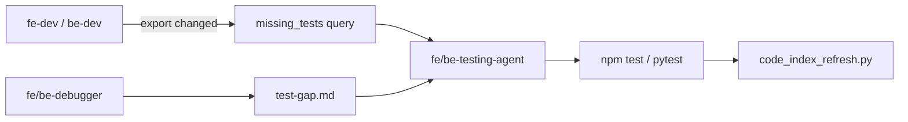

# Testing guide

> **Policy:** [`rules-testing.md`](rules/rules-testing.md) · **Agent:** `fe-testing-agent` / `be-testing-agent` · **Index:** [`fe-tests.md`](context/fe-tests.md) / [`be-tests.md`](context/be-tests.md) (auto-synced)

This PoC uses **colocated unit/integration tests only** — Vitest + React Testing Library (FE), pytest + TestClient (BE). No separate E2E layer in scope.

---

## Test stack

| Layer | Tool | Location | What it tests |
|-------|------|----------|---------------|
| FE unit / integration | Vitest + RTL | `apps/web-react/src/**/*.test.{ts,tsx}` | Hooks, API clients, components, App |
| BE integration | pytest + TestClient | `apps/api/tests/test_*.py` | Routes, services, DB persistence |
| Shared FE setup | — | `apps/web-react/src/test-setup.ts` | jest-dom + i18n init |

---

## When tests get written (agent flow)



| Trigger | Who writes tests | Priority |
|---------|------------------|----------|
| New/changed **export** with no test file | `fe-testing-agent` / `be-testing-agent` | Run `missing_tests` after implementation |
| **`test-gap.md`** exists (bug-fix task) | Same testing agents | **Mandatory** — implement every row; overrides missing_tests-only |
| fe-dev / be-dev finished a step | Orchestrator dispatches testing agent | Per `plan.md` |

---

## How to run

### Frontend (from `apps/web-react/`)

```powershell
npm install --legacy-peer-deps   # first time only
npm test                         # vitest run — all tests
npx vitest run src/components/BaseButton/BaseButton.test.tsx   # single file
npx vitest run --watch           # watch mode
```

### Backend (from `apps/api/`)

```powershell
pip install -r requirements.txt
python -m pytest tests/ -q
python -m pytest tests/test_toggle_state.py -q
```

### After adding tests

```powershell
# from repo root
python scripts/code_index_refresh.py --repo .
python scripts/code_index_query.py --repo . missing_tests
```

`missing_tests` must return `[]`. `fe-tests.md` / `be-tests.md` update automatically on refresh.

---

## Creating tests — step-by-step (testing agents)

### 1. Determine scope

```powershell
python scripts/code_index_query.py --repo . missing_tests
```

If `docs/working/<TASK-ID>/test-gap.md` exists → read it **first**; implement **every** listed test (even when the symbol already has a file).

### 2. Read sources

- The export under test (component, hook, route, service)
- Existing colocated test file (extend) or create new sibling file
- [`rules-testing.md`](rules/rules-testing.md), [`rules-i18n.md`](rules/rules-i18n.md) (FE UI copy)
- [`fe-i18n.md`](context/fe-i18n.md) for locale keys used in assertions

### 3. Identify behaviors

For each export, test **observable behavior**, not implementation details:

| Kind | Test |
|------|------|
| API client | fetch/PUT called with correct URL/body; error on non-ok |
| Hook | initial load, persist/toggle, error rollback |
| Component | render states, user events, aria/testids, CSS modifier classes |
| Route | status code, JSON body, persistence across GET after PUT |
| i18n UI | assert with `i18n.t('namespace:key')` — not hardcoded English |

### 4. Write tests (AAA)

Every test uses **Arrange → Act → Assert** comments.

### 5. Run until green

Fix failures in **test files only** unless the bug is in production code (then hand off to debugger).

### 6. Register in index

```powershell
python scripts/code_index_refresh.py --repo .
```

Never mark a testing step done while tests fail or `missing_tests` is non-empty.

---

## FE patterns (Vitest + RTL)

### API client

```typescript
import { afterEach, describe, expect, it, vi } from 'vitest'
import { fetchToggleState } from './toggleState'

afterEach(() => {
  vi.unstubAllGlobals()
})

describe('toggleState API', () => {
  it('fetchToggleState returns JSON', async () => {
    vi.stubGlobal('fetch', vi.fn().mockResolvedValue({
      ok: true,
      json: async () => ({ value: false }),
    }))
    await expect(fetchToggleState()).resolves.toEqual({ value: false })
  })
})
```

### Hook

```typescript
import { act, renderHook, waitFor } from '@testing-library/react'
import { vi } from 'vitest'
import * as toggleApi from '../api/toggleState'
import { useToggleState } from './useToggleState'

it('persists toggled value', async () => {
  vi.spyOn(toggleApi, 'fetchToggleState').mockResolvedValue({ value: false })
  vi.spyOn(toggleApi, 'saveToggleState').mockResolvedValue({ value: true })

  const { result } = renderHook(() => useToggleState())
  await waitFor(() => expect(result.current.loading).toBe(false))

  await act(async () => {
    await result.current.toggle()
  })

  expect(toggleApi.saveToggleState).toHaveBeenCalledWith(true)
})
```

### Component (with i18n)

```typescript
import { render, screen } from '@testing-library/react'
import userEvent from '@testing-library/user-event'
import i18n from '../../i18n'
import { BaseButton } from './BaseButton'

it('renders true label when value is true', () => {
  render(<BaseButton value={true} onChange={vi.fn()} />)
  expect(screen.getByText(i18n.t('common:toggle.true'))).toBeInTheDocument()
})
```

`test-setup.ts` loads `./i18n` — do not hardcode UI strings when a key exists in `fe-i18n.md`.

### Selector priority (RTL)

1. `getByRole` (with accessible name)
2. `getByTestId` (project uses `data-testid`)
3. `getByText` only for non-i18n or via `i18n.t(...)`

---

## BE patterns (pytest)

### Route + DB (use isolated temp DB)

```python
@pytest.fixture
def client(tmp_path: Path, monkeypatch: pytest.MonkeyPatch):
    db_file = tmp_path / "test.db"
    monkeypatch.setenv("DATABASE_URL", f"sqlite:///{db_file}")
    init_db()
    with TestClient(app) as test_client:
        yield test_client

def test_get_toggle_state_defaults_false(client: TestClient):
    response = client.get("/api/toggle-state")
    assert response.status_code == 200
    assert response.json() == {"value": False}
```

Colocate: `apps/api/tests/test_<module>.py` covers routes/services in scope.

---

## Regression from debugger (`test-gap.md`)

1. **fe-debugger** / **be-debugger** fills [`test-gap.template.md`](working/test-gap.template.md) → `docs/working/<TASK-ID>/test-gap.md`
2. Must include **Why existing tests did not catch this**
3. **Testing agent** adds each listed test (new file or extend existing)
4. Task not done until test-gap tests pass + refresh OK

---

## Anti-patterns

| Avoid | Do instead |
|-------|------------|
| Hardcoded locale strings in FE assertions | `i18n.t('app:toggle.on')` |
| Tests in `__tests__/` or distant folders | Colocate next to source |
| One test covering many unrelated flows | One behavior per test |
| Testing private internals | Public UI, API contract, hook return values |
| Skipping tests because symbol “already has a file” | Read `test-gap.md` — add regression cases |
| Marking task done before refresh | `code_index_refresh.py` exit 0 |

---

## Handoff from fe-dev / be-dev

When implementation is ready for tests, append to `run-log.md` or use [`test-handoff.template.md`](working/test-handoff.template.md):

- Files changed
- New/changed exports
- Testable behaviors (bullets)
- i18n keys added (FE)
- Suggested test file paths

Orchestrator then dispatches the testing agent.

---

## Existing test files (reference)

See auto-synced catalogs:

- [`docs/context/fe-tests.md`](context/fe-tests.md)
- [`docs/context/be-tests.md`](context/be-tests.md)
