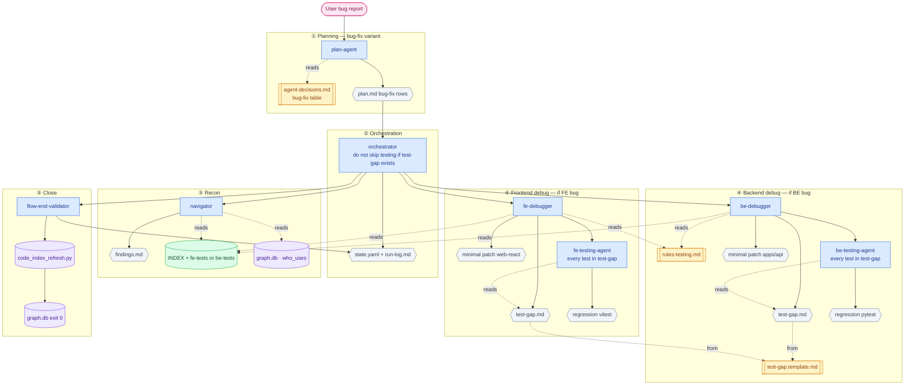
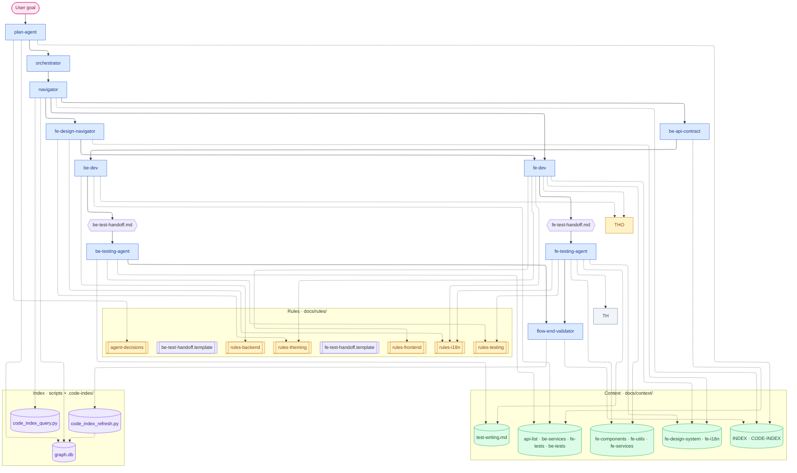
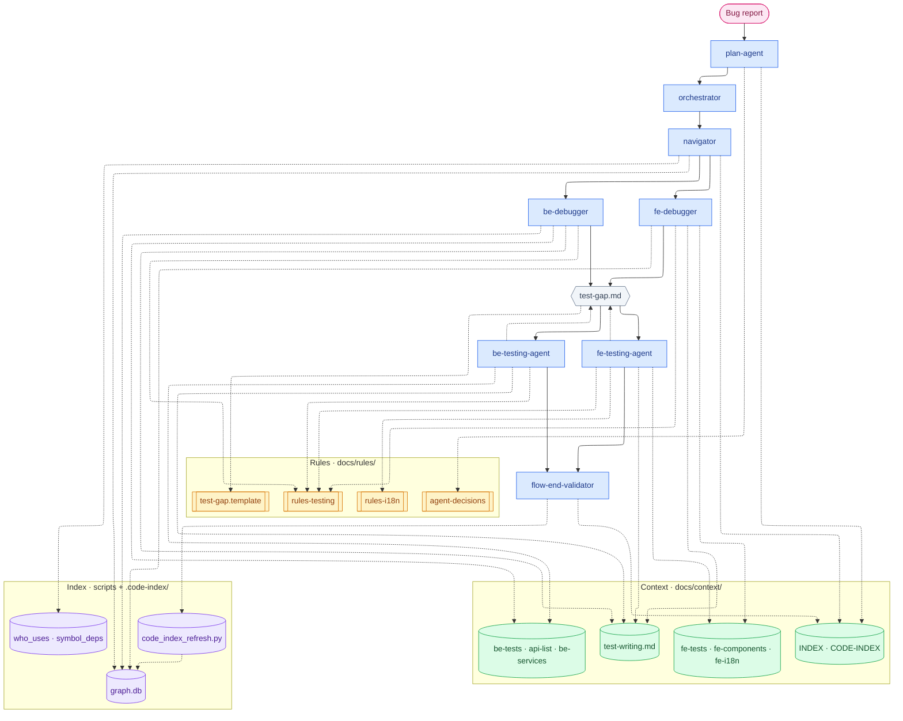

# Agentic workflow — flowcharts

> **Recommended:** §3 Development · §4 Debugging — include rules, context, and index.  
> **How to read:** solid arrow = runs/writes · dashed arrow = reads only

## Legend

| Visual | Meaning | Examples |
|--------|---------|----------|
| Pink stadium `([ ])` | **User** | goal, bug report |
| Blue rectangle `[ ]` | **Agent** | plan-agent, fe-dev, be-debugger |
| Amber rectangle `[[ ]]` | **Rules** | agent-decisions.md, rules-testing.md |
| Green cylinder `[( )]` | **Context** | fe-components.md, api-list.md |
| Purple cylinder `[( )]` | **Index** | graph.db, code_index_*.py |
| Gray doc `{{ }}` | **Working artifact** | plan.md, test-gap.md, be/fe-test-handoff.md |
| Guide `( )` in context band | **docs/context/test-writing.md** | Test creation workflow (not auto-synced) |

---

## 1. Full development flow

End-to-end feature work (full-stack). Skip BE or FE steps when scope is UI-only or API-only.

```mermaid
flowchart TD
  USER(["User goal"])

  subgraph PLAN["① Planning"]
    PA["plan-agent"]
    RULES1[["agent-decisions.md"]]
    CTX1[("context INDEX + symbol MDs")]
    IDX1[("graph.db + query scripts")]
    INTAKE{{"intake.md + plan.md"}}
  end

  subgraph ORCH["② Orchestration"]
    OR["orchestrator"]
    STATE{{"state.yaml + run-log.md"}}
  end

  subgraph RECON["③ Recon — always step 1"]
    NAV["navigator"]
    FIND{{"findings.md"}}
  end

  subgraph UI_RECON["③b UI recon — if UI task"]
    FDN["fe-design-navigator"]
    DS[("fe-design-system.md")]
    I18N[("fe-i18n.md")]
    RTH[["rules-theming.md"]]
    RI18N[["rules-i18n.md"]]
  end

  subgraph BE["④ Backend lane — apps/api + contract"]
    direction TB
    BAC["be-api-contract"]
    BD["be-dev"]
    BTA["be-testing-agent"]
    CONTRACT{{"packages/contract/openapi.yaml"}}
    API{{"apps/api routes + services"}}
    BET{{"colocated pytest tests"}}
    CTXBE[("api-list · be-services · be-tests")]
    RB[["rules-backend.md"]]
    RT[["rules-testing.md"]]
  end

  subgraph FE["⑤ Frontend lane — apps/web-react"]
    direction TB
    FD["fe-dev"]
    FTA["fe-testing-agent"]
    UI{{"components · hooks · i18n · theme.css"}}
    FET{{"colocated vitest tests"}}
    CTXFE[("fe-components · fe-utils · fe-services")]
    RF[["rules-frontend.md"]]
  end

  subgraph CLOSE["⑥ Close — every task"]
    FEV["flow-end-validator"]
    REF[("code_index_refresh.py")]
    GDB[("graph.db validated")]
  end

  USER --> PA
  PA -. reads .-> RULES1
  PA -. reads .-> CTX1
  PA -. reads .-> IDX1
  PA --> INTAKE

  INTAKE --> OR
  OR --> STATE
  OR --> NAV
  NAV -. reads .-> CTX1
  NAV -. reads .-> IDX1
  NAV --> FIND

  OR --> FDN
  FDN -. reads .-> DS
  FDN -. reads .-> I18N
  FDN -. reads .-> RTH
  FDN -. reads .-> RI18N
  FDN --> FIND

  OR --> BAC
  BAC -. reads .-> CTXBE
  BAC --> CONTRACT
  OR --> BD
  BD -. reads .-> CTXBE
  BD -. reads .-> RB
  BD --> API
  OR --> BTA
  BTA -. reads .-> RT
  BTA -. reads .-> CTXBE
  BTA --> BET

  OR --> FD
  FD -. reads .-> CTXFE
  FD -. reads .-> RF
  FD -. reads .-> RTH
  FD -. reads .-> RI18N
  FD --> UI
  OR --> FTA
  FTA -. reads .-> RT
  FTA -. reads .-> RI18N
  FTA --> FET

  OR --> FEV
  FEV --> REF
  REF --> GDB
  API -. sync .-> GDB
  UI -. sync .-> GDB
  BET -. sync .-> GDB
  FET -. sync .-> GDB
  FEV --> STATE

  classDef user fill:#fce7f3,stroke:#db2777,color:#831843
  classDef agent fill:#dbeafe,stroke:#2563eb,color:#1e3a8a
  classDef rule fill:#fef3c7,stroke:#d97706,color:#92400e
  classDef context fill:#dcfce7,stroke:#16a34a,color:#14532d
  classDef index fill:#ede9fe,stroke:#7c3aed,color:#4c1d95
  classDef artifact fill:#f1f5f9,stroke:#64748b,color:#334155

  class USER user
  class PA,NAV,OR,FDN,BAC,BD,BTA,FD,FTA,FEV agent
  class RULES1,RT,RB,RF,RTH,RI18N rule
  class CTX1,CTXBE,CTXFE,DS,I18N context
  class IDX1,REF,GDB index
  class INTAKE,STATE,FIND,CONTRACT,API,BET,UI,FET artifact
```

### Development order (reference)

| Step | Agent | Lane |
|------|-------|------|
| 0 | plan-agent | Control |
| — | orchestrator | Control |
| 1 | navigator | Shared |
| 1b | fe-design-navigator | Frontend (UI only) |
| 2 | be-api-contract | Backend |
| 3 | be-dev | Backend |
| 4 | be-testing-agent | Backend |
| 5 | fe-dev | Frontend |
| 6 | fe-testing-agent | Frontend |
| 7 | flow-end-validator | Close |

---

## 2. Debugging flow

For goals: **fix · bug · broken**. Testing step is **never skipped** when `test-gap.md` exists.

### Debug sequence (reference)

| Step | Agent | Output |
|------|-------|--------|
| 1 | navigator | findings.md |
| 2 | fe-debugger **or** be-debugger | fix + **test-gap.md** |
| 3 | fe-testing-agent **or** be-testing-agent | all regression tests pass |
| 4 | flow-end-validator | graph.db validated |

---

## 3. Development flow — with rules, context & index

Recommended chart. **Solid arrows** = execution · **Dashed arrows** = read only.

### Who reads what (development)

| Agent | Rules | Context / docs | Index |
|-------|-------|----------------|-------|
| plan-agent | agent-decisions | INDEX, CODE-INDEX | graph.db |
| navigator | — | INDEX + symbol MDs | query scripts |
| fe-design-navigator | theming, i18n | fe-design-system, fe-i18n | — |
| be-api-contract | rules-backend | api-list, types | — |
| be-dev | rules-backend | api-list, be-services | find_symbol · writes **be-test-handoff.md** |
| be-testing-agent | rules-testing | test-writing, be-tests, be-test-handoff | missing_tests |
| fe-dev | frontend, theming, i18n | fe-*, fe-i18n | find_symbol · writes **fe-test-handoff.md** |
| fe-testing-agent | rules-testing, rules-i18n | test-writing, fe-tests, fe-i18n, fe-test-handoff | missing_tests |
| flow-end-validator | — | CODE-INDEX | code_index_refresh |

---

## 4. Debugging flow — with rules, context & index

### Who reads what (debugging)

| Agent | Rules | Context / docs | Index |
|-------|-------|----------------|-------|
| plan-agent | agent-decisions (bug-fix table) | INDEX | — |
| navigator | — | INDEX, fe-tests or be-tests | graph.db, who_uses |
| fe-debugger | rules-testing | test-writing, fe-tests, fe-components, fe-i18n | who_uses |
| be-debugger | rules-testing | test-writing, be-tests, api-list | who_uses |
| fe-testing-agent | rules-testing, **rules-i18n** | **test-writing**, test-gap.md, fe-tests, fe-i18n | — |
| be-testing-agent | rules-testing | **test-writing**, test-gap.md, be-tests | — |
| flow-end-validator | — | CODE-INDEX | code_index_refresh |
