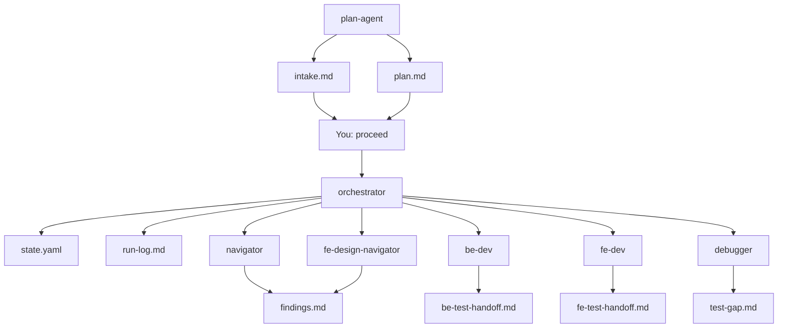

# Task artifacts — why each file exists

> Every file under `docs/working/<TASK-ID>/` is a **handoff between agents or between agents and you**.  
> Agents do not message each other in chat — they read and write these files.

**Quick index:** [working/INDEX.md](INDEX.md) · Templates in this folder · Orchestrator owns the flow: [orchestrator.agent.md](../../.github/agents/orchestrator.agent.md)

---

## Overview — the problem they solve

Without these files, a multi-agent run would lose:

- **What you asked for** vs **what the AI decided** (scope, stack, out-of-scope)
- **Which step we are on** and whether you approved the last step
- **What already exists** in the repo vs what must be created
- **What to test** after dev agents finish (separate BE/FE lanes)
- **What tests were missing** when a bug slipped through

Each artifact has one primary job. Overlap between `intake` and `plan`, or `state.yaml` and `run-log.md`, is intentional: different audiences (why vs what, machine vs human).

---

## `intake.md`

| | |
|---|---|
| **Written by** | `plan-agent` |
| **Read by** | You (first checkpoint), `orchestrator` (startup validation) |
| **Template** | [intake.template.md](intake.template.md) |

### Why it exists

You only provide **one goal in plain language**. The intake records that goal **verbatim** plus every **AI decision** the system made without asking you — stack, scope, reuse, test policy, acceptance criteria.

### What it handles

- **User goal** — the single source of truth for *what you wanted*
- **AI decisions table** — documents *why* this task is FE-only, full-stack, SQLite vs in-memory, etc.
- **Acceptance checkboxes** — derived success criteria (also copied into `plan.md`)

### Reason it is separate from `plan.md`

- **Intake** = decisions and rationale (**why** we are doing this)
- **Plan** = executable steps (**how** agents will do it)

If someone asks *"why did we add an API?"* six months later, intake answers that. Plan only says *"run be-api-contract step 2"*.

---

## `plan.md`

| | |
|---|---|
| **Written by** | `plan-agent` |
| **Read by** | You (first checkpoint), `orchestrator` (every step) |
| **Template** | [plan.template.md](plan.template.md) |
| **Immutable for** | `orchestrator` — wrong plan → back to `plan-agent`, not edited in place |

### Why it exists

Specialists are narrow. They need a **shared runbook**: which agent runs in which order, what files to read, what folder they may touch, and when the step is `done`.

### What it handles

- **Goal** — one-line summary
- **Acceptance** — checkboxes mapped to `done_when` on steps
- **Steps table** — `agent`, `task`, `context_files`, `scope`, `done_when`
- **Variants** — full-stack feature rows vs bug-fix rows (shorter path)

### Reason it exists as its own file

The orchestrator executes **one row at a time**. Without `plan.md`, you would re-explain the whole pipeline on every Cursor session. Plan is the contract between planning and execution.

---

## `state.yaml`

| | |
|---|---|
| **Written by** | `orchestrator` (ongoing), `flow-end-validator` (final `phase: done`) |
| **Read by** | `orchestrator` only (you do not edit unless debugging) |
| **Template** | [state.template.yaml](state.template.yaml) |

### Why it exists

`run-log.md` is for humans. The orchestrator needs **structured state** to resume after interruptions: current step, per-step status, human gate approval, blockers, timestamps.

### What it handles

- **`phase`** — `planning` \| `executing` \| `awaiting_human` \| `done` \| `blocked`
- **`current_step`** — which plan row is active
- **`steps[]`** — per agent: `status`, `gate_status`, `notes`, optional `files_written`
- **`human_gate` / `awaiting_human`** — whether execution is paused for your `proceed`
- **`blocker`** — why the task is stuck

### Reason it exists

Multi-step work spans many chat sessions. `state.yaml` is the **save game** so the orchestrator never asks *"which step were we on?"*

---

## `run-log.md`

| | |
|---|---|
| **Written by** | `orchestrator` (each step), `flow-end-validator` (final row) |
| **Read by** | You, `plan-agent` (previous task's log when planning the next TASK) |
| **Template** | [run-log.template.md](run-log.template.md) |

### Why it exists

Same events as `state.yaml`, but in a **table you can read in a PR or demo** without parsing YAML.

### What it handles

- Per step: **agent**, **status**, **files read**, **files written**, **outcome**
- Optional **summary** — task name, started/completed dates
- Audit trail for presentations (e.g. TASK-002 walkthrough)

### Reason it exists alongside `state.yaml`

| `state.yaml` | `run-log.md` |
|--------------|--------------|
| Machine-readable | Human-readable |
| Orchestrator logic | Demos, reviews, history |
| Gate flags, phases | "What files did be-dev touch?" |

---

## `findings.md`

| | |
|---|---|
| **Written by** | `navigator` (reuse/create), `fe-design-navigator` (appends **Design findings**) |
| **Read by** | You (checkpoints), `fe-dev` (Design findings required), orchestrator |
| **Template** | None — structure defined in agent files |

### Why it exists

Before writing code, agents must know **what to reuse vs create**. The index (`graph.db`) holds symbols; findings translate that into **task-specific actions** for this TASK only.

### What it handles

**From navigator (step 1):**

- Index query results
- **Reuse** — extend existing files/symbols
- **Create** — new paths and purpose (BE, FE, contract)

**From fe-design-navigator (UI tasks, before fe-dev):**

- **Design findings** — theme tokens, i18n keys, base/extending components to reuse
- **Gaps** — new tokens, keys, or components `fe-dev` must create

### Reason it exists

`plan.md` says *"build BaseButton"*. Findings say *"BaseButton does not exist — create here; reuse App.tsx; reuse these API routes"*. Design findings add *"use `--color-flow-active-dot`, key `app.toggle.on`, extend Base not FlowDialog"*.

**Overlap with navigator:** navigator lists FE paths at file level; design-navigator goes deeper on **how** UI must be built (theme/i18n/tiers). Same file, different sections.

---

## `be-test-handoff.md`

| | |
|---|---|
| **Written by** | `be-dev` (required after BE implementation) |
| **Read by** | You (checkpoint), `be-testing-agent` |
| **Template** | [be-test-handoff.template.md](be-test-handoff.template.md) |

### Why it exists

`be-dev` must **not** write tests. Something must tell `be-testing-agent` **what behaviors matter** for the exports that just landed — without the testing agent re-reading all of `apps/api/`.

### What it handles

- Files changed under `apps/api/`
- New/changed **exports** (routes, services, models)
- **Testable behaviors** — status codes, JSON shape, DB persistence, errors
- Suggested `apps/api/tests/test_*.py` paths
- Notes — fixtures, temp SQLite, env vars

### Reason it is separate from `fe-test-handoff.md`

Backend and frontend are **different lanes**: pytest vs vitest, different agents, different templates. One shared handoff file caused overwrite confusion — split keeps BE and FE test scope explicit.

---

## `fe-test-handoff.md`

| | |
|---|---|
| **Written by** | `fe-dev` (required after FE implementation) |
| **Read by** | You (checkpoint), `fe-testing-agent` |
| **Template** | [fe-test-handoff.template.md](fe-test-handoff.template.md) |

### Why it exists

Same pattern as BE handoff: `fe-dev` implements UI; `fe-testing-agent` owns tests. Handoff lists **observable UI behaviors**, new **i18n keys**, and mock requirements.

### What it handles

- Files changed under `apps/web-react/`
- Components, hooks, API clients
- Testable behaviors — render, click, hook state, mocked `fetch`
- **i18n keys added** — so tests use `i18n.t()`, not hardcoded strings
- Suggested colocated `*.test.tsx` paths

### Reason it exists

Frontend tests need **i18n and mock context** that BE handoff does not cover. FE lane stays self-contained for vitest + RTL.

---

## `test-gap.md`

| | |
|---|---|
| **Written by** | `be-debugger` or `fe-debugger` (bug-fix tasks only) |
| **Read by** | You, `be-testing-agent` or `fe-testing-agent`, `orchestrator` (never skip testing step) |
| **Template** | [test-gap.template.md](test-gap.template.md) |

### Why it exists

When a bug ships, the process failed twice: **the code** and **the tests**. `test-gap.md` forces the debugger to document **why existing tests did not catch it** and **exactly which regression tests to add**.

### What it handles

- Bug summary and reproduction
- **Why tests missed it** — missing scenario, weak assertion, over-mock, wrong layer, no test yet
- **Tests to add** — file, test name, assertion (mandatory list)
- **Fix scope** — minimal change; what was intentionally not refactored

### Reason it exists

`missing_tests` only finds exports **without any test file**. It does not find **wrong or incomplete tests**. Test-gap overrides normal gap-fill policy — testing agent must implement **every row**, even if a test file already exists.

**Not used on feature tasks** — use `be-test-handoff.md` / `fe-test-handoff.md` instead.

---

## Flow — when each file appears

---

## Who reads what (summary)

| File | Writer | Primary readers |
|------|--------|-----------------|
| `intake.md` | plan-agent | you, orchestrator |
| `plan.md` | plan-agent | you, orchestrator |
| `state.yaml` | orchestrator, flow-end-validator | orchestrator |
| `run-log.md` | orchestrator, flow-end-validator | you, plan-agent |
| `findings.md` | navigator, fe-design-navigator | you, fe-dev, orchestrator |
| `be-test-handoff.md` | be-dev | you, be-testing-agent |
| `fe-test-handoff.md` | fe-dev | you, fe-testing-agent |
| `test-gap.md` | be/fe-debugger | you, be/fe-testing-agent |

Specialists usually receive **scope and task from orchestrator** (copied from `plan.md`), not by opening `plan.md` themselves.

---

## What is NOT in this folder

| Location | Role |
|----------|------|
| `docs/context/*.md` | Long-lived catalog (routes, components, tests) — synced with `graph.db` |
| `packages/contract/openapi.yaml` | API contract — not per-task |
| `apps/**` | Application source — changed by dev agents |

Task artifacts are **ephemeral per TASK**; context MDs are **durable across tasks**.
